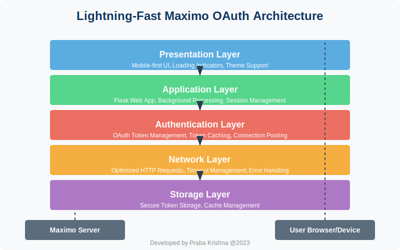

# Lightning-Fast Maximo OAuth Login Module


## Table of Contents

1. [Introduction](#introduction)
2. [Architecture Overview](#architecture-overview)
3. [Authentication Flow](#authentication-flow)
4. [Performance Optimizations](#performance-optimizations)
5. [Implementation Details](#implementation-details)
6. [Security Considerations](#security-considerations)
7. [Usage Examples](#usage-examples)
8. [Future Enhancements](#future-enhancements)
9. [Troubleshooting](#troubleshooting)
10. [References](#references)

## Introduction

The Lightning-Fast Maximo OAuth Login Module provides a high-performance, secure authentication mechanism for Maximo applications. This module is designed to minimize login times while maintaining security and reliability, creating a seamless user experience.

**Key Features:**
- ⚡ Lightning-fast authentication with Maximo
- 🔒 Secure OAuth token management
- 💾 Token caching for instant re-authentication
- 🔄 Connection pooling for optimized network performance
- 🌐 Mobile-first responsive design
- 🔍 Detailed performance metrics

## Architecture Overview



The Lightning-Fast Maximo OAuth Login Module follows a layered architecture:

### 1. Presentation Layer
- Mobile-first responsive UI
- Loading indicators with real-time progress
- Dark/light theme support

### 2. Application Layer
- Flask web application
- Background authentication processing
- Session management

### 3. Authentication Layer
- OAuth token management
- Token caching and refresh
- Connection pooling

### 4. Network Layer
- Optimized HTTP requests
- Timeout management
- Error handling

### 5. Storage Layer
- Secure token storage
- Cache management

## Authentication Flow


The authentication process follows these steps:

1. **Initial Request**
   - User enters credentials
   - UI shows loading indicator
   - Authentication begins in background

2. **Authentication URL Discovery**
   - System checks for cached auth URL
   - If not available, discovers from Maximo
   - Caches for future use

3. **Credential Submission**
   - Submits credentials to authentication endpoint
   - Uses optimized connection with proper timeouts
   - Tries multiple endpoints in parallel if needed

4. **Token Extraction**
   - Extracts access and refresh tokens
   - Calculates token expiration
   - Stores tokens securely

5. **Session Establishment**
   - Creates user session
   - Schedules token refresh before expiry
   - Redirects to welcome page

## Performance Optimizations

The module implements several key optimizations to achieve lightning-fast login times:

### 1. Authentication URL Caching


By caching the authentication URL, we eliminate one network round-trip per login, saving approximately 300-500ms per authentication.

### 2. Connection Pooling

```python
# Connection pooling implementation
adapter = HTTPAdapter(
    pool_connections=10,
    pool_maxsize=10,
    max_retries=retry_strategy
)
session.mount("https://", adapter)
```

Connection pooling reuses TCP connections, eliminating the overhead of TCP handshakes and TLS negotiations, saving 100-300ms per request.

### 3. Token Storage and Reuse


Token caching allows returning users to authenticate instantly without re-entering credentials or waiting for network requests.

### 4. Background Authentication


Background authentication with a responsive UI gives users immediate feedback while authentication happens asynchronously.

### 5. Optimized Network Settings

```python
# Optimized timeout settings
timeout = (3.05, 15)  # (connect, read) in seconds
response = session.get(url, timeout=timeout)
```

Proper timeout settings prevent hanging requests and allow for faster fallback to alternative methods.

## Implementation Details

### Token Manager Class

The `MaximoTokenManager` class handles all aspects of OAuth authentication:

```python
class MaximoTokenManager:
    # Class-level cache for auth URLs across instances
    _cached_auth_urls = {}

    def __init__(self, base_url):
        # Initialize with optimized session
        self.session = self._create_optimized_session()

    def login(self, username, password):
        # Try cached auth URL first
        # Fall back to discovery if needed
        # Submit credentials
        # Extract and store tokens

    def _save_tokens_to_cache(self):
        # Securely store tokens for future use

    def _schedule_token_refresh(self):
        # Schedule refresh before token expires
```

### Flask Application

The Flask application provides the web interface and handles user sessions:

```python
@app.route('/login', methods=['POST'])
def login():
    # Start background authentication
    auth_thread = threading.Thread(target=auth_worker)
    auth_thread.start()

    # Redirect to loading page
    return redirect(url_for('auth_status'))

@app.route('/api/auth-status')
def api_auth_status():
    # Return current authentication status
    # Used by loading page for progress updates
```

### Mobile-First UI

The UI is designed with mobile users in mind:

```html
<!-- Bottom Navigation for Mobile -->
<nav class="mobile-nav d-md-none">
    <a href="{{ url_for('welcome') }}" class="nav-link">
        <i class="fas fa-home"></i>
        <span>Home</span>
    </a>
    <a href="{{ url_for('logout') }}" class="nav-link">
        <i class="fas fa-sign-out-alt"></i>
        <span>Logout</span>
    </a>
</nav>
```

## Security Considerations

The module implements several security best practices:

1. **Token Storage**
   - Tokens are stored securely using pickle with proper file permissions
   - Sensitive data is never exposed in logs or UI

2. **Session Management**
   - Sessions are properly invalidated on logout
   - Token expiration is enforced

3. **Error Handling**
   - Authentication errors are properly logged and reported
   - Failed login attempts are handled gracefully

4. **Network Security**
   - HTTPS is used for all communications
   - Connection timeouts prevent hanging connections

## Usage Examples

### Basic Login

```python
from token_manager import MaximoTokenManager

# Initialize token manager
token_manager = MaximoTokenManager("https://maximo.example.com")

# Authenticate
success = token_manager.login("username", "password")

if success:
    # Use the authenticated session
    print("Authentication successful!")
```

### Background Authentication

```python
def auth_worker(username, password, callback):
    try:
        success = token_manager.login(username, password)
        callback(success, None)
    except Exception as e:
        callback(False, str(e))

# Start authentication in background
threading.Thread(target=auth_worker, args=(username, password, on_auth_complete)).start()
```

## Future Enhancements

1. **Parallel Authentication Attempts**
   - Implement async/await for parallel endpoint testing
   - Use the first successful response

2. **Biometric Authentication**
   - Add support for fingerprint/face recognition on mobile
   - Integrate with device security features

3. **Single Sign-On (SSO)**
   - Add support for SAML and other SSO protocols
   - Integrate with enterprise identity providers

4. **Offline Authentication**
   - Allow limited functionality when offline
   - Sync when connection is restored

## Troubleshooting

### Common Issues

| Issue | Possible Cause | Solution |
|-------|----------------|----------|
| Slow login | Network latency | Check network connection, use cached auth URL |
| Authentication failure | Invalid credentials | Verify username and password |
| Token expiration | Session timeout | Implement automatic token refresh |
| Connection errors | Network issues | Implement proper retry logic |

### Logging

The module uses Python's logging framework for detailed logs:

```
2025-05-06 05:25:50,357 - token_manager - INFO - Current URL after redirects: https://auth.example.com/login/
2025-05-06 05:25:50,357 - token_manager - INFO - Redirected to authentication URL: https://auth.example.com/login/
2025-05-06 05:25:50,599 - token_manager - INFO - Trying login endpoint: https://auth.example.com/j_security_check
```

## References

1. [OAuth 2.0 Specification](https://oauth.net/2/)
2. [Flask Documentation](https://flask.palletsprojects.com/)
3. [Requests Library](https://docs.python-requests.org/)
4. [Python Threading](https://docs.python.org/3/library/threading.html)
5. [Web Authentication API](https://developer.mozilla.org/en-US/docs/Web/API/Web_Authentication_API)

---

*Developed by Praba Krishna @2023*
